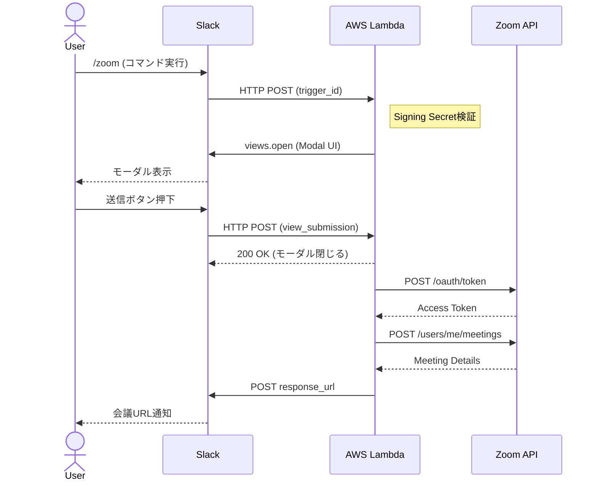
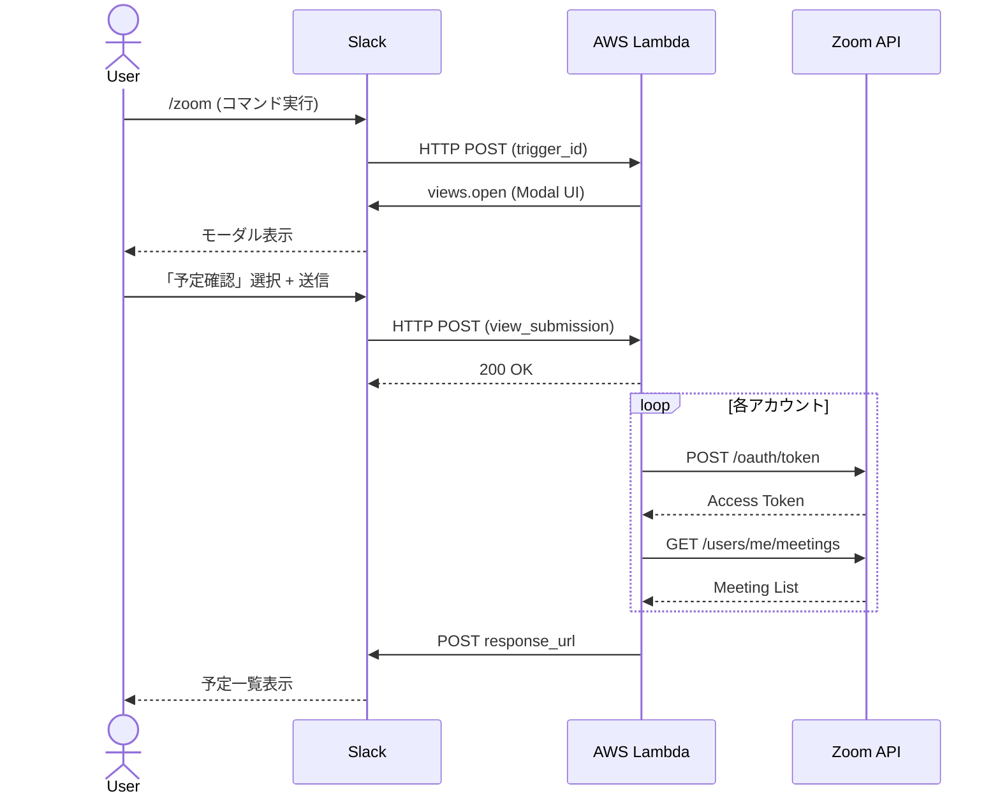

# 基本設計書

## 1. ドキュメント情報

| 項目 | 内容 |
|------|------|
| **プロジェクト名** | Slack Zoom Bot |
| **バージョン** | 1.1.0 |
| **作成日** | 2024-12-30 |
| **更新日** | 2024-12-30 |
| **ステータス** | Draft |

---

## 2. システム概要

### 2.1 目的

SlackのSlash Command (`/zoom`) をトリガーに、インタラクティブなフォーム（モーダル）を用いて、指定したZoomアカウントでの会議作成および予定確認を行うBotシステム。

### 2.2 スコープ

#### 対象範囲（In Scope）

- Slack Slash Command によるトリガー
- 3つのZoomアカウントの管理
- 会議作成（即時/予約）
- 当日の予定確認
- モーダルUIによる操作

#### 対象外（Out of Scope）

- Zoom Webhook によるイベント通知
- 会議の編集・削除
- 複数日にまたがる予定確認
- ユーザー認証・権限管理

---

## 3. 機能要件

### 3.1 機能一覧

| ID | 機能名 | 優先度 | 説明 |
|----|--------|--------|------|
| F-001 | 会議作成 | Must | 選択したアカウントでZoom会議を作成 |
| F-002 | 予定確認 | Must | 当日の会議予定を一覧表示 |
| F-003 | モーダル表示 | Must | Slash Command後にモーダルUIを表示 |
| F-004 | アカウント選択 | Must | 3つのZoomアカウントから選択 |
| F-005 | 所要時間選択 | Must | 30分/60分/90分から選択 |
| F-006 | エラー通知 | Should | API失敗時のユーザー通知 |

### 3.2 機能詳細

#### F-001: 会議作成

```
入力:
  - Zoomアカウント（A/B/C）
  - 会議時間（30/60/90分）
  - 会議名（任意）

処理:
  1. 選択されたアカウントのクレデンシャル取得
  2. Zoom APIでアクセストークン取得
  3. 会議作成API呼び出し
  4. 結果をSlackに通知

出力:
  - 会議URL
  - 会議ID
  - 開始時刻
```

#### F-002: 予定確認

```
入力:
  - Zoomアカウント（A/B/C/全て）

処理:
  1. 対象アカウントのクレデンシャル取得
  2. Zoom APIでアクセストークン取得
  3. 会議一覧API呼び出し（当日分）
  4. 結果を整形してSlackに通知

出力:
  - 会議名リスト
  - 開始時刻リスト
  - 参加URLリスト
```

---

## 4. 非機能要件

### 4.1 性能要件

| 項目 | 要件 | 理由 |
|------|------|------|
| 応答時間 | Ack: 3秒以内 | Slack仕様の制約 |
| 完了時間 | 10秒以内 | UX観点 |
| 同時接続数 | 10リクエスト/分 | 個人利用想定 |

### 4.2 可用性要件

| 項目 | 要件 |
|------|------|
| 稼働率 | 99.0%（AWS Lambda SLA準拠） |
| 計画停止 | なし（サーバーレス） |

### 4.3 セキュリティ要件

| 項目 | 対策 |
|------|------|
| リクエスト検証 | Slack Signing Secret検証 |
| 認証情報管理 | 環境変数 or AWS Secrets Manager |
| 通信 | HTTPS必須 |
| ログ | 機密情報のマスキング |

### 4.4 運用要件

| 項目 | 要件 |
|------|------|
| ログ保持期間 | 30日 |
| モニタリング | CloudWatch Logs |
| アラート | Lambda エラー発生時 |

### 4.5 コスト要件

| 項目 | 目標 |
|------|------|
| 月額運用費 | $0（無料枠内） |
| 初期費用 | $0 |

---

## 5. アーキテクチャ設計

### 5.1 システム構成図

```
┌─────────────────────────────────────────────────────────────────┐
│                        Slack Platform                            │
│  ┌─────────┐                                                    │
│  │  User   │──────── /zoom command ──────────────┐              │
│  └─────────┘                                      │              │
│       ▲                                           ▼              │
│       │                                    ┌──────────────┐      │
│       │◄────────── Modal 表示 ─────────────│ Slack API    │      │
│       │                                    └──────────────┘      │
│       │                                           │              │
│       │◄────────── 結果通知 ──────────────────────┘              │
└───────│─────────────────────────────────────────────────────────┘
        │                      │
        │                      ▼
┌───────│──────────────────────────────────────────────────────────┐
│       │              AWS Cloud                                   │
│       │                                                          │
│       │        ┌─────────────────────┐                          │
│       │        │   Lambda Function   │                          │
│       │        │   (Function URL)    │◄─── HTTPS エンドポイント  │
│       │        │                     │                          │
│       │        │  ┌───────────────┐  │     ┌─────────────────┐  │
│       └────────┼──│ Slack Bolt    │  │     │ CloudWatch Logs │  │
│                │  │ (TypeScript)  │──┼────►│                 │  │
│                │  └───────────────┘  │     └─────────────────┘  │
│                │          │          │                          │
│                │          ▼          │                          │
│                │  ┌───────────────┐  │                          │
│                │  │ Environment   │  │                          │
│                │  │ Variables     │  │                          │
│                │  └───────────────┘  │                          │
│                └─────────┬───────────┘                          │
│                          │                                      │
└──────────────────────────│──────────────────────────────────────┘
                           │
                           ▼
┌─────────────────────────────────────────────────────────────────┐
│                      Zoom Cloud                                  │
│                                                                  │
│  ┌────────────────┐  ┌────────────────┐  ┌────────────────┐     │
│  │  Account A     │  │  Account B     │  │  Account C     │     │
│  │  (S2S OAuth)   │  │  (S2S OAuth)   │  │  (S2S OAuth)   │     │
│  └────────────────┘  └────────────────┘  └────────────────┘     │
│                                                                  │
└─────────────────────────────────────────────────────────────────┘
```

### 5.2 コンポーネント構成

| コンポーネント | 役割 | 技術 |
|----------------|------|------|
| Lambda Function | リクエスト処理 | Node.js 20.x |
| AwsLambdaReceiver | Slackイベント受信 | @slack/bolt |
| Slack Bolt App | Slackイベント処理 | @slack/bolt |
| Zoom Client | Zoom API通信 | axios |
| Config Manager | 設定管理 | 環境変数 |

### 5.3 技術選定理由

#### TypeScript vs Java

| 観点 | TypeScript | Java (Spring Boot) |
|------|------------|-------------------|
| コールドスタート | 100-300ms ✅ | 3-10秒 ❌ |
| メモリ使用量 | 128-256MB ✅ | 512MB以上 |
| 開発速度 | 速い ✅ | 中程度 |
| Slack SDK対応 | 公式SDK充実 ✅ | 限定的 |
| 学習コスト | 低い ✅ | 高い |
| 無料枠適合 | 適合 ✅ | 超過リスク |

**結論**: TypeScriptを採用

#### デプロイ方式

| 観点 | Lambda Function URL | API Gateway |
|------|---------------------|-------------|
| コスト | 無料 ✅ | 有料 |
| 設定複雑度 | 低い ✅ | 高い |
| 機能 | 必要十分 ✅ | 過剰 |

**結論**: Lambda Function URLを採用

---

## 6. データ設計

### 6.1 設定データ構造

```typescript
interface ZoomAccount {
  id: string;           // アカウント識別子（a, b, c）
  name: string;         // 表示名
  accountId: string;    // Zoom Account ID
  clientId: string;     // OAuth Client ID
  clientSecret: string; // OAuth Client Secret
}

interface Config {
  slack: {
    signingSecret: string;
    botToken: string;
  };
  zoom: {
    accounts: ZoomAccount[];
  };
}
```

### 6.2 環境変数一覧

| 変数名 | 説明 | 必須 |
|--------|------|------|
| `SLACK_SIGNING_SECRET` | Slack署名検証用 | ✅ |
| `SLACK_BOT_TOKEN` | SlackBot トークン | ✅ |
| `ZOOM_ACCOUNT_A_ID` | アカウントA ID | ✅ |
| `ZOOM_ACCOUNT_A_CLIENT_ID` | アカウントA Client ID | ✅ |
| `ZOOM_ACCOUNT_A_CLIENT_SECRET` | アカウントA Client Secret | ✅ |
| `ZOOM_ACCOUNT_B_*` | アカウントB用（上記同様） | ✅ |
| `ZOOM_ACCOUNT_C_*` | アカウントC用（上記同様） | ✅ |

---

## 7. 外部インターフェース設計

### 7.1 Slack API

#### Slash Command リクエスト

```http
POST /slack/events
Content-Type: application/x-www-form-urlencoded

token=xxx
&team_id=T0001
&team_domain=example
&channel_id=C2147483705
&channel_name=test
&user_id=U2147483697
&user_name=goyle
&command=/zoom
&text=
&trigger_id=xxxxx
&response_url=https://hooks.slack.com/commands/xxx
```

#### Modal Open API

```http
POST https://slack.com/api/views.open
Authorization: Bearer xoxb-xxx
Content-Type: application/json

{
  "trigger_id": "xxxxx",
  "view": { /* Modal View JSON */ }
}
```

### 7.2 Zoom API

#### Token取得（Server-to-Server OAuth）

```http
POST https://zoom.us/oauth/token
Content-Type: application/x-www-form-urlencoded
Authorization: Basic base64(client_id:client_secret)

grant_type=account_credentials&account_id=xxx
```

#### 会議作成

```http
POST https://api.zoom.us/v2/users/me/meetings
Authorization: Bearer {access_token}
Content-Type: application/json

{
  "topic": "Slackからの会議",
  "type": 2,
  "start_time": "2024-12-30T10:00:00Z",
  "duration": 60,
  "timezone": "Asia/Tokyo"
}
```

#### 会議一覧取得

```http
GET https://api.zoom.us/v2/users/me/meetings?type=upcoming&page_size=10
Authorization: Bearer {access_token}
```

---

## 8. 処理フロー

### 8.1 会議作成フロー



### 8.2 予定確認フロー



---

## 9. エラーハンドリング

### 9.1 エラー分類

| コード | 種類 | 対応 |
|--------|------|------|
| E001 | Slack検証失敗 | 401返却、ログ出力 |
| E002 | Zoomトークン取得失敗 | ユーザー通知、リトライ |
| E003 | Zoom会議作成失敗 | ユーザー通知、詳細ログ |
| E004 | タイムアウト | ユーザー通知 |
| E999 | 予期しないエラー | ユーザー通知、詳細ログ |

### 9.2 エラーメッセージ

```typescript
const ERROR_MESSAGES = {
  E001: '認証に失敗しました。管理者にお問い合わせください。',
  E002: 'Zoom接続に失敗しました。しばらく待ってから再試行してください。',
  E003: '会議作成に失敗しました。入力内容を確認してください。',
  E004: '処理がタイムアウトしました。再試行してください。',
  E999: '予期しないエラーが発生しました。管理者にお問い合わせください。',
};
```

---

## 10. テスト方針

### 10.1 テスト種類

| 種類 | 対象 | ツール |
|------|------|--------|
| ユニットテスト | 各モジュール | Vitest |
| 統合テスト | API連携 | Vitest + MSW |
| E2Eテスト | 全体フロー | 手動 |

### 10.2 テストカバレッジ目標

- ユニットテスト: 80%以上
- 統合テスト: 主要パス網羅

---

## 11. デプロイメント

### 11.1 環境構成

| 環境 | 用途 | AWS Region |
|------|------|------------|
| dev | 開発・テスト | ap-northeast-1 |
| prod | 本番 | ap-northeast-1 |

### 11.2 デプロイフロー

```
main branch
    │
    ▼
GitHub Actions
    │
    ├── Lint / Type Check
    ├── Unit Test
    │
    ▼
Serverless Framework Deploy
    │
    ├── TypeScript → JavaScript (esbuild)
    ├── Lambda Function 更新
    │
    ▼
AWS Lambda (Function URL)
```

---

## 12. 情報源一覧

| 種類 | URL |
|------|-----|
| Slack Bolt SDK | https://slack.dev/bolt-js/ |
| Slack Block Kit Builder | https://app.slack.com/block-kit-builder |
| Zoom API Reference | https://developers.zoom.us/docs/api/ |
| Zoom S2S OAuth | https://developers.zoom.us/docs/internal-apps/s2s-oauth/ |
| AWS Lambda Best Practices | https://docs.aws.amazon.com/lambda/latest/dg/best-practices.html |
| Serverless Framework | https://www.serverless.com/framework/docs |

---

## 変更履歴

| 日付 | バージョン | 変更内容 | 担当 |
|------|-----------|---------|------|
| 2024-12-30 | 1.0.0 | 初版作成 | Goyle |
| 2024-12-30 | 1.1.0 | アーキテクチャ図・コンポーネント構成を修正 | Goyle |
